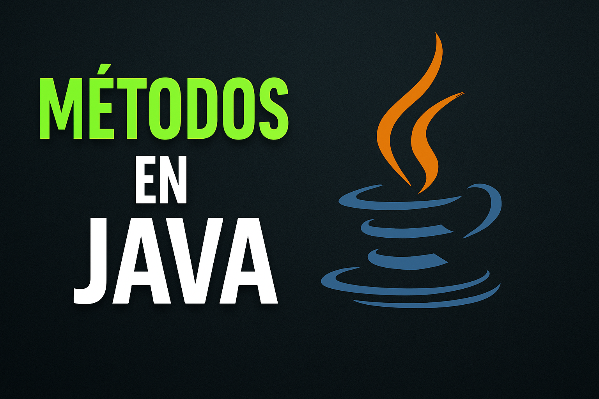

<!DOCTYPE html>
<html lang="en">
<head>
    <meta charset="UTF-8">
    <meta name="viewport" content="width=device-width, initial-scale=1.0">

</head>
<body>
 
  <h1 align="center">Metodos en Java 👨‍💻</h1>
    

     
    

 <h2 align="left"> 📙 | Introduccion a metodos en Java</h2>
  

En Java, los métodos son bloques de código que realizan tareas específicas y pueden ser reutilizados a lo largo del programa. Representan una forma tradicional y estructurada de organizar la lógica, facilitando la modularidad y el mantenimiento del código. Un método en Java se define con un nombre, un tipo de retorno, y puede recibir parámetros para operar sobre datos de entrada.

El uso adecuado de los métodos permite encapsular comportamientos, promover la reutilización y mejorar la legibilidad del código, valores que han sido pilares fundamentales en el desarrollo de software desde sus orígenes. Además, los métodos en Java pueden clasificarse en estáticos o de instancia, dependiendo de si pertenecen a la clase o a un objeto en particular, lo que ofrece flexibilidad para diseñar sistemas robustos y bien estructurados.
  

  
<h2 align="left"> 🔎📄 | Explicacion de metodos Java</h2>

Un método en Java es un conjunto de instrucciones que se agrupan para realizar una tarea concreta dentro de un programa. La creación y uso de métodos es una práctica tradicional en la programación estructurada y orientada a objetos, pues facilita la organización y reutilización del código, valores que se han mantenido vigentes con el paso del tiempo.

<h3 align="left"> 🤔 | Parte de metodos Java</h3>

Un método típico en Java consta de los siguientes elementos fundamentales

  
Modificador de acceso

  

    Define la visibilidad del método dentro del proyecto (por ejemplo, <code>public</code>, <code>private</code>).
  

  

    
ver más

    

      Los modificadores de acceso determinan desde dónde puede ser accedido un método. Por ejemplo, <code>public</code> permite el acceso desde cualquier clase; <code>private</code> restringe el acceso a la clase donde se declara; <code>protected</code> permite acceso dentro del mismo paquete o subclases; y si no se especifica (package-private), solo puede ser accedido dentro del mismo paquete. Esto proporciona control sobre la encapsulación y seguridad del código.
    

  

  
Tipo de retorno

  

    Indica el tipo de dato que el método devolverá al finalizar su ejecución.
  

  

    
ver más

    

      El tipo de retorno es fundamental en Java, ya que especifica el tipo de valor que el método entregará. Puede ser un tipo primitivo como <code>int</code>, <code>boolean</code>, <code>double</code>, un objeto como <code>String</code> o <code>List</code>, o <code>void</code> si el método no devuelve ningún valor. El valor devuelto debe coincidir con el tipo declarado.
    

  

  
Nombre del método

  

    Es la identificación del método y debe seguir las convenciones de nomenclatura de Java.
  

  

    
ver más

    

      El nombre del método debe ser descriptivo y usar notación camelCase, iniciando con minúscula. Por ejemplo: <code>calcularPromedio</code>, <code>obtenerDatos</code>. Un buen nombre mejora la comprensión del código y su mantenibilidad. Además, el nombre debe ser único dentro de la clase (aunque puede haber sobrecarga si se diferencian en parámetros).
    

  

  
Parámetros (opcionales)

  

    Son los valores que el método recibe para operar con datos externos.
  

  

    
ver más

    

      Los parámetros se definen entre los paréntesis del encabezado del método. Cada parámetro tiene un tipo de dato y un identificador. Ejemplo: <code>public void saludar(String nombre)</code>. Aquí <code>String nombre</code> es un parámetro. Si no se requiere información externa, se dejan los paréntesis vacíos: <code>()</code>.
    

  

  
Cuerpo del método

  

    Contiene las instrucciones que se ejecutan al invocar el método.
  

  

    
ver más

    

      El cuerpo del método está delimitado por llaves <code>{ }</code> y contiene la lógica de ejecución. Allí se escriben sentencias como operaciones, ciclos, condiciones o llamadas a otros métodos. Por ejemplo: 
      <pre><code>public int cuadrado(int x) {
    return x * x;
}</code></pre>
      Este método devuelve el cuadrado del número recibido como parámetro.
    

  

   

  
Modificador de acceso

  
Define la visibilidad del método por ejemplo <code>public</code> <code>private</code>

  
  

    
ver mas

    
<code>public</code> permite el acceso desde cualquier clase, mientras que <code>private</code> restringe su uso únicamente dentro de la misma clase.

  

    
Tipo de retorno

    
Indica el tipo de dato que el método devolverá al finalizar su ejecución. Puede ser un tipo <code>primitivo</code>, un <code>objeto</code> o <code>void</code> si no devuelve ningún valor.

    

        
ver mas

        
 el tipo de dato que el método devolverá tras su ejecución, pudiendo ser tipos primitivos <code>int</code> <code>boolean</code>  objetos o void si             no retorna ningún valor

    

    
Nombre de metodo con su union del proceso

    
Debe seguir igual al proceso que se hara si es un menu entonces debe llamarse menu

    

        <pre>
            <code align="center">
                public static void menu(){
                // logica para el menu
                }
            }
             y se llama en el main con menu();
            </code>
        </pre>
    

  
Tipo de retorno

  

    Indica el tipo de dato que el método devolverá al finalizar su ejecución. Puede ser un tipo <code>primitivo</code>, un <code>objeto</code> o <code>void</code> si no devuelve ningún valor.
  

  

    
ver más

    

      El tipo de retorno es esencial para determinar qué tipo de resultado ofrece un método. Java es un lenguaje fuertemente tipado, por lo tanto, todo método que no sea <code>void</code> debe devolver obligatoriamente un valor del tipo declarado.  
      Ejemplos de tipos primitivos: <code>int</code>, <code>double</code>, <code>char</code>, <code>boolean</code>. 
      También se puede retornar un objeto, como una instancia de una clase personalizada, por ejemplo <code>Persona</code>, <code>String</code> o una colección como <code>List&lt;String&gt;</code>. 
      El tipo <code>void</code> indica que el método no devuelve ningún valor.
    

  

  
Parámetros (opcionales)

  

    Valores que el método recibe para operar. Los parámetros permiten que un método trabaje con información que le es pasada desde el exterior.
  

  

    
ver más

    

      Los parámetros son variables que se declaran entre los paréntesis del encabezado del método. Cada parámetro tiene un tipo de dato y un nombre, separados por comas si hay más de uno.  
      Por ejemplo: <code>public int sumar(int a, int b)</code> 
      Aquí, <code>a</code> y <code>b</code> son parámetros de tipo <code>int</code>. 
      Los métodos también pueden no tener parámetros, y en ese caso se escriben los paréntesis vacíos <code>()</code>.
    

  

  
Cuerpo del método

  

    Contiene las instrucciones que se ejecutan cuando el método es llamado. Está delimitado por llaves <code>{ }</code>.
  

  

    
ver más

    

      El cuerpo del método es el bloque donde se define la lógica que el método ejecutará. Aquí se colocan las sentencias necesarias para realizar la tarea que se espera del método: operaciones, condiciones, bucles, llamadas a otros métodos, etc.  
      Ejemplo: 
        <pre>
      <code>
        public int cuadrado(int x) { 
        &nbsp;&nbsp;&nbsp;&nbsp;return x * x; 
        }
      </code>
        </pre>
      
      En este caso, el cuerpo contiene una única instrucción: retornar el cuadrado del número recibido.
    

  

 

 
<h3 align="left">🔦 | Clasificacion de metodos</h3>

 En Java, los métodos pueden clasificarse principalmente en dos tipos según su relación con la clase y los objetos: <code>métodos estáticos</code> y <code>metodos de instancia</code>

  
Métodos estáticos (<code>static</code>)

  

    Son aquellos que pertenecen a la clase en sí, no a una instancia específica. Esto significa que pueden ser llamados directamente usando el nombre de la clase, sin necesidad de crear un objeto.
  

  
  

    
ver más

    

      Los métodos estáticos son ideales para operaciones auxiliares o utilitarias que no dependen de los datos de una instancia específica. No pueden acceder directamente a atributos o métodos no estáticos de la clase, ya que no operan sobre un objeto en particular.  

      <strong>Ejemplo:</strong> 
      <pre><code>
public class Matematica {
    public static int sumar(int a, int b) {
        return a + b;
    }
}
      </code></pre>
      <strong>Invocación:</strong> <code>Matematica.sumar(3, 4);</code>
    

  

  
Métodos de instancia

  

    Estos métodos requieren que se cree un objeto de la clase para poder ser invocados. Operan sobre los atributos de esa instancia, accediendo a su estado interno.
  

  
  

    
ver más

    

      Los métodos de instancia son los más comunes en la programación orientada a objetos. Al acceder a través de un objeto, pueden leer y modificar los atributos de dicha instancia, permitiendo una lógica personalizada según el estado del objeto.  
      <strong>Ejemplo:</strong> 
      <pre><code>
public class Persona {
    private String nombre;
    public Persona(String nombre) {
        this.nombre = nombre;
    }
    public void saludar() {
        System.out.println("Hola, soy " + nombre);
    }
}
      </code></pre>
      <strong>Invocación:</strong> 
      <pre><code>
Persona p = new Persona("Juan");
p.saludar();
      </code></pre>
      La elección entre un método estático o uno de instancia dependerá de si se necesita o no acceder al estado particular de un objeto. Si no es necesario, un método estático puede ser más adecuado y eficiente.
    

  

  

 
<h2 align="left"> 🎖️ | Ventajas de uso de <strong>Metodos</strong></h2>

El uso de métodos en Java representa una práctica esencial de la programación estructurada y orientada a objetos. Permiten estructurar mejor el código, hacerlo más claro, reutilizable y fácil de mantener

  
Reutilización del código

  

    Permite encapsular una lógica para usarla en diferentes partes del programa, evitando la repetición de código.
  

  

    
ver más

    

      La reutilización de código mediante métodos permite escribir una función una sola vez y luego invocarla cuantas veces sea necesario. Esto no solo reduce la redundancia, sino que también mejora la eficiencia del desarrollo. Además, facilita la localización y corrección de errores, ya que cualquier cambio en el comportamiento se hace en un único lugar.
    

  

  
Modularidad

  

    Ayuda a dividir el programa en partes más pequeñas y manejables.
  

  

    
ver más

    

      La modularidad implica descomponer un programa en componentes independientes, cada uno representado por un método con una responsabilidad específica. Esto facilita el diseño, desarrollo y pruebas del software, permitiendo incluso la colaboración entre distintos programadores que pueden trabajar en métodos diferentes sin interferencias.
    

  

  
Legibilidad

  

    Facilita la comprensión del programa al tener bloques de código separados y con nombres descriptivos.
  

  

    
ver más

    

      Cuando el código está organizado en métodos bien nombrados, el flujo del programa se vuelve más claro. Leer nombres como <code>calcularPromedio()</code> o <code>validarEntrada()</code> es mucho más intuitivo que interpretar directamente una secuencia de instrucciones complejas. Esto mejora la comunicación entre desarrolladores y la comprensión del sistema en general.
    

  

  
🔧 Mantenimiento

  

    Permite realizar cambios o mejoras de forma centralizada y segura.
  

  

    
ver más

    

      Al concentrar la lógica en métodos específicos, cualquier corrección o mejora puede hacerse sin afectar el resto del programa. Si el método se reutiliza en varios lugares, con una sola modificación se actualiza automáticamente en todos ellos. Esto disminuye el riesgo de errores y mejora la sostenibilidad del software a largo plazo.
    

  

 

 

<h2 align="center"> ✨ | Reto de metodos JAVA</h2>
    <table>
  <tr>
    <td align="center">
       
      
<strong>Reto de metodos en Java #1 </strong>

      
    </td>
  </tr>
</table>

 

</body>
</html>
 

  Hecho con ❤️ por BlackConsole / Aka. 007x86 🕵️  
   
    
  rendirse no es una opcion - Aka. 007x86

  🚀 ¡Gracias por visitar mi perfil!

